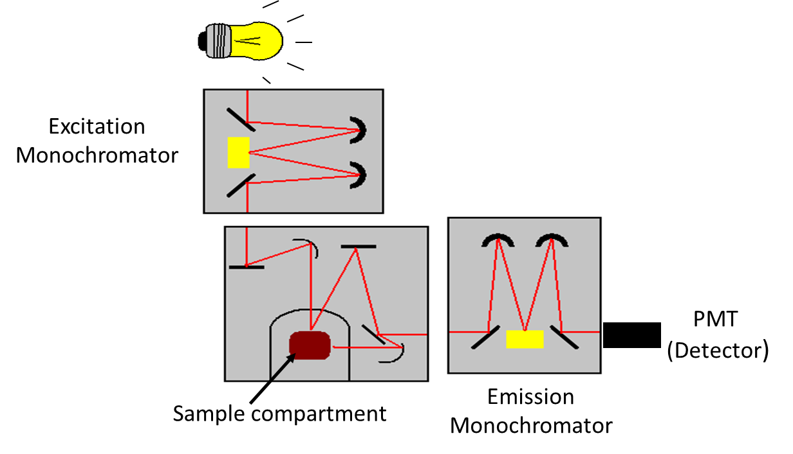
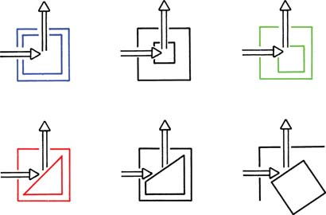

#### Instrumentation Principle

Like other spectrometers, major components of standard fluorescence lab instrument include (1) Radiation source (e.g., broadband Xe arc lamp, monochromatic LED, laser); (2) Excitation and emission wavelength selector (e.g., monochromator, spectrograph); (3) Sample compartment; and (4) Detector (e.g., Photo Multiplier Tube (PMT), CCD camera), (Figure 1) in addition to the data processing and display unit. Use of a laser instead of a lamp as an excitation source allows one to work at low fluorophore concentrations, because a laser has higher intensity than that of a lamp. However, excitation with a laser could accelerate the rate of photo-bleaching in the cases of light-sensitive fluorophores. Two types of collection geometry in sample compartment are used avoiding the transmitted light (Figure 2). 'Right angle' collection geometry, in which emitted light is collected at a right angle (90o) to the incident light, is often used. This geometry is appropriate for optically transparent sample like solution. In 'front face' collection geometry, emitted light is collected at an acute angle relative to the incident beam. This geometry is used for an optically absorbing/scattering sample. In right angle geometry, signal reaching detector will be significantly diminished for high absorbance (optical density) sample unlike the front face collection geometry where light is absorbed near the surface of the cuvette containing the absorber. More sophisticated instruments are used for the measurement of fluorescence life time (time-resolved spectra) and fluorescence polarization measurements.

Figure 1. Schematic of a standard laboratory spectrofluorimeter.

Figure 2: Schematic of collection geometry in fluorescence spectrometers. Top Row: Right- angle and off-center illuminations. Bottom Row: Front-face illumination with either triangular cuvettes or square cuvettes oriented at 30o to 60o relative to the incident beam. (Courtesy: Reference 5) 

The following types of measurements are generally performed with a spectrofluorimeter: (i) recording of emission spectra and (ii) excitation spectra. In emission spectra, the emission intensity as a function of the emission wavelength is observed (the excitation wavelength is fixed and the different wavelengths of fluorescent light emitted by a sample are measured using a monochromator). An excitation spectrum is the opposite. In excitation spectra, where the emission intensity as a function of the excitation wavelength is observed (the detection wavelength is fixed and the excitation wavelength is scanned through many different wavelengths across a region of interest via a monochromator). In other words, the emission spectrum corresponds to the variations of fluorescence intensity IF as a function of emission wavelength &#955;em (the wavelength at which the fluorescence is observed), the excitation wavelength &#955;ex being fixed; whereas the excitation spectrum reflects the variations of IF as a function of &#955;ex, the observation wavelength &#955;em being fixed.

It should be noted that fluorescence spectra can be presented on a wavelength scale (intensity vs. &#955;) or sometimes on a frequency (&#957;), or wavenumber (&#7804;) scale (wavelengths and wavenumbers are reciprocal of each other). In most commercially available instruments, fluorescence spectra are recorded on the wavelength scale. Since corrected spectra are not needed on a routine basis, we are more familiar with the directly recorded uncorrected spectra on the wavelength scale and sometimes such spectra are easier to interpret visually. One should note that if two or more different substances are responsible for the observed fluorescence, then the excitation spectrum varies with the choice of emission wavelength. One should also be careful to distinguish the analyte molecule fluorescence from the Rayleigh and Raman scattering radiations generated by the sample. Here working of a spectrofluorimeter is demonstrated first schematically and then by running excitation-emission spectral scans of a common fluorophore, fluorescein, in ethanol. 

